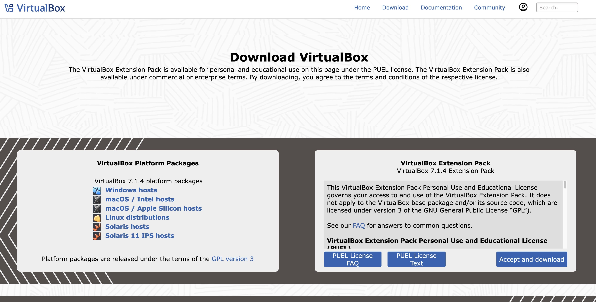
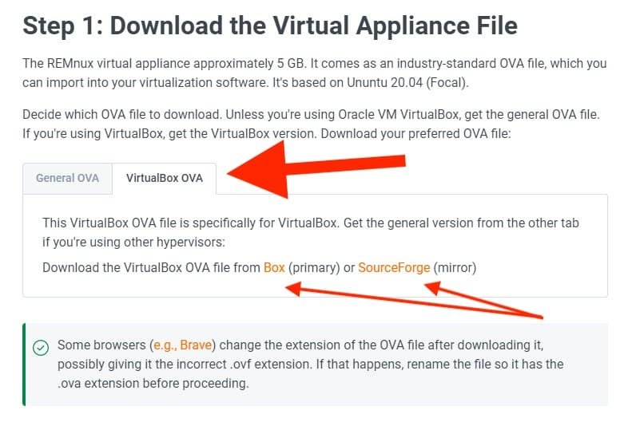
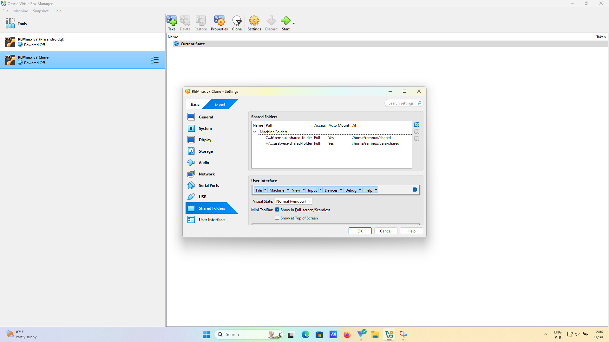

# Capítulo 6: Máquinas Virtuais e REMnux

Neste capítulo, você vai instalar o **REMnux**, um kit de ferramentas para análise de _malware,_ baseado em Linux. O REMnux vem com muitas ferramentas já instaladas, o que facilita a realização de algumas das tarefas que vamos aprender. Como o REMnux é baseado no Ubuntu, uma distribuição comum do Linux, há outras ferramentas que não fazem parte do REMnux, mas que podemos instalar facilmente.

Instalaremos o REMnux como uma **máquina virtual** (termo geralmente abreviado como VM, do inglês _Virtual Machine_). Você pode pensar em uma máquina virtual como um “computador dentro de um computador”.

### Máquinas virtuais e instantâneos (_snapshots_)

Em seu computador físico (chamado de '**hospedeiro'**, ou _host_ em inglês), um programa chamado de '**hipervisor'** pode iniciar uma ou mais máquinas virtuais (chamadas de '**convidadas'** ou _guests_ em inglês). Cada uma delas permitirá que você faça praticamente tudo o que poderia fazer se fosse uma máquina real separada, sem precisar ter um computador físico para cada uma delas. Por exemplo, você pode configurar uma máquina hospedeira com Windows e executar Linux em uma máquina virtual, o que oferece quase todos os benefícios de executar os dois sistemas operacionais, mas em um único computador. Você também pode configurar uma máquina hospedeira Linux e executar Windows em uma máquina virtual!&#x20;

Há muitos tipos de hipervisores. E várias opções para executar máquinas virtuais em seu laptop ou computador de mesa, como VMware, Hyper-V para Windows \[16], Parallels para macOS e **VirtualBox**. Usaremos o VirtualBox, cuja instalação é gratuita e funciona em muitos sistemas operacionais.

Um dos aspectos mais úteis das máquinas virtuais é a capacidade de fazer '**instantâneos'**. Um instantâneo armazena o estado atual do sistema operacional da máquina virtual, incluindo o que está sendo executado ativamente quando ela está ligada. Você pode voltar para um instantâneo anterior se algo der errado. É uma boa prática fazer um instantâneo antes de fazer grandes alterações para que você possa revertê-las, se necessário.&#x20;

Um instantâneo é diferente de um backup. O backup armazena todos os dados, mas apenas isso. O instantâneo armazena todas as informações do sistema operacional, inclusive quais programas estão em execução e quais janelas estão abertas \[17]. No entanto, ele faz isso de forma eficiente e armazena apenas o que for necessário para reverter para aquele estado. Você não precisa entender os detalhes disso, basta ter em mente que os instantâneos geralmente são muito menores que os backups.

Ainda assim, os instantâneos podem ocupar muito espaço em seu computador. Se você tira instantâneos regularmente, certifique-se de excluir os que não precisa mais.

Outra grande vantagem das máquinas virtuais, especialmente ao usar instantâneos, é que você pode reverter se algo der errado. Por exemplo, se quiser fazer algumas alterações de configuração com potencial de bagunçar tudo em uma máquina virtual, pode fazer um instantâneo primeiro. Se as alterações de configuração realmente bagunçarem tudo, basta reverter para o instantâneo anterior!

Isso faz com que máquinas virtuais sejam ideais para lidar com arquivos que podem ter malware. Você pode armazená-los em uma máquina virtual e executar várias ferramentas para analisá-los. Em teoria, você poderia até mesmo executá-los e, depois, reverter para um instantâneo feito anteriormente. Você não fará isso neste capítulo e, em um capítulo posterior, quando aprender sobre _sandboxes_, descobrirá por que é muito complicado fazer isso.

A análise de arquivos sem executá-los é chamada de **análise estática** (ao contrário da **análise dinâmica**, na qual os arquivos são executados). Com a análise estática, não é necessário se preocupar em isolar a máquina virtual do seu _host_ e da internet.

### REMnux

A maioria dos malwares é escrita para outros sistemas operacionais que não o Linux. Portanto, se você realizar sua análise no Linux, não poderá causar danos ao executá-los acidentalmente. O Linux também não executa antivírus por padrão, como o Microsoft Defender para Windows, então, você não precisa se preocupar com a possibilidade de qualquer um dos seus arquivos ser marcado como suspeito, ou mesmo como malware. Por fim, muitas ferramentas de análise de malware são desenvolvidas para o Linux.

O REMnux é apenas uma versão do Linux (uma “distribuição Linux”) que tem muitas dessas ferramentas pré-instaladas, o que o faz ideal para análise. Embora a instalação de programas no Linux seja bastante simples na maioria dos casos, você ocasionalmente se deparará com problemas de dependência, em que seu programa requer a instalação de outro programa (isto é, _depende_ de outro programa) ou a alteração de uma configuração específica. Ao usar o REMnux, você não precisará se preocupar em instalar as ferramentas individuais e, ao mesmo tempo, terá uma máquina Linux totalmente funcional.&#x20;

Se estiver usando um computador macOS com um chip M1 ou M2, pule para a seção no final deste capítulo. Por motivos técnicos, não é possível instalar o REMnux em um processador desse tipo, nem mesmo em uma máquina virtual e ou em um hipervisor especial como o Parallels. O restante desta seção pressupõe que você esteja executando a arquitetura X86. Se estiver executando o Windows ou o Linux, é quase certo que esteja.&#x20;

Para instalar o REMnux, primeiro baixe o VirtualBox em seu [site oficial](https://www.virtualbox.org/). Como alternativa, se você estiver usando o Linux como sistema operacional hospedeiro, poderá instalá-lo diretamente por meio do gerenciador de pacotes da sua distribuição, o que é mais fácil e mais seguro, mesmo que seja apenas porque há menos probabilidade de cometer erros.

<figure><figcaption></figcaption></figure>

Durante a instalação, basta seguir as instruções. É importante verificar se há espaço livre em disco suficiente: o ideal é que tenha pelo menos 30GB para instalar e usar o REMnux, embora você provavelmente possa usar um pouco menos.&#x20;

Depois de instalar o VirtualBox, você pode fazer download do REMnux, no [site oficial](https://remnux.org/), em seu computador hospedeiro.&#x20;

<figure><figcaption></figcaption></figure>

É importante que você baixe o arquivo .ova projetado especificamente para o VirtualBox, disponível nos links na aba VirtualBox OVA.

<figure><figcaption></figcaption></figure>

Após baixá-lo, clique duas vezes no arquivo .ova para instalá-lo. Se isso não funcionar, você também pode seguir as instruções fornecidas pelo site do REMnux. Você pode deixar as configurações como sugeridas durante o processo de instalação, mas certifique-se de escolher (pelo menos) duas CPUs.&#x20;

Observe que o REMnux sugere que você confirme o valor do _hash_. Se não se sentir à vontade para fazer isso, não se preocupe; você pode pular essa etapa. É apenas uma maneira simples de confirmar que você baixou o arquivo correto sem nenhum problema. Ele também poderia detectar uma versão desonesta do REMnux, mas a probabilidade de isso acontecer é mínima e a proteção que ele oferece está longe de ser perfeita.

### Executando o REMnux pela primeira vez

No VirtualBox, inicie o sistema operacional convidado para iniciar o REMnux. Você pode fazer login com o nome de usuário 'remnux' e a senha 'malware'. Obviamente, essa não é uma senha segura. Isso não é uma grande preocupação porque, para acessar sua instância do REMnux, um adversário precisaria ter acesso ao seu computador hospedeiro e, se ele tiver isso, uma senha forte não oferecerá nenhuma proteção. O REMnux não foi projetado para proteger segredos contra um sistema hospedeiro já infiltrado ou comprometido!

Depois de fazer o login, abra um terminal clicando em “Activities” (Atividades) e, em seguida, no ícone do terminal. Digite no terminal:

`remnux upgrade`

Isso instalará as versões mais recentes de todas as ferramentas. Você também deve executar:

`remnux update`

Isso garantirá que o sistema operacional do REMnux esteja atualizado.

Você deve fazer esta atualização regularmente, e é recomendável que execute pelo menos o primeiro comando antes de iniciar uma investigação importante.

Se você nunca usou o REMnux antes, dedique algum tempo para se familiarizar com o ambiente. Por exemplo, abra o navegador Firefox e confirme se consegue abrir páginas da web, bem como o explorador de arquivos, para ver como é possível visualizar os arquivos em seu diretório pessoal

> Exercício 6.1. Você pode pular este exercício se já tiver trabalhado com máquinas virtuais antes. Caso contrário, ele é uma maneira simples de se familiarizar com o conceito de instantâneos. Deixaremos que você descubra como cada etapa é executada. Observe apenas que um instantâneo é algo que você faz no hipervisor (o programa da máquina virtual, como VirtualBox), não no sistema operacional convidado (por exemplo, REMnux).

1. Tire um instantâneo de sua instância do REMnux.
2. Crie um arquivo de teste em algum lugar. Certifique-se de que você pode ver o arquivo no navegador de arquivos.
   1. sugerimos que consulte o Exercício 4.25 do Guia de Campo Para Resposta a Incidentes da Mídia e Sociedade Civil ([Field Guide to incident response for civil society and media](https://internews.org/wp-content/uploads/2023/11/Field-Guide-to-Threat-Labs.pdf)) caso não saiba como criar o arquivo utilizando linha de comando.
3. Reverta para o instantâneo tirado anteriormente. Provavelmente será perguntado se você deseja salvar o estado atual; você pode dizer “não”.&#x20;
4. Confirme no navegador de arquivos que o arquivo que você criou não está mais lá.
5. Exclua o instantâneo

### Manuseio de arquivos maliciosos

Antes de analisar um arquivo no REMnux, você precisa ter certeza de que o arquivo foi baixado ou copiado para a máquina virtual.

Uma maneira de fazer isso é usar o Firefox instalado no REMnux para fazer login em seu e-mail ou serviço de nuvem onde o arquivo está localizado e baixá-lo de lá. Isso deve funcionar, mas é preciso ter cuidado.

Embora o Ubuntu, sistema operacional no qual o REMnux se baseia, seja geralmente seguro, o REMnux foi projetado para análise, não para lidar com conteúdo confidencial. Portanto, é uma boa prática evitar conectar o REMnux diretamente às contas de e-mail ou de nuvem da sua organização. Em vez disso, você pode configurar uma conta do Google separada para essa finalidade e, em seguida, conectar-se a partir dela ao REMnux.

Um método alternativo é criar uma pasta compartilhada que será acessível tanto pelo hospedeiro quanto pelo convidado do REMnux. Você pode fazer isso facilmente no VirtualBox. Primeiro, no hospedeiro, crie uma nova pasta em algum lugar, por exemplo, na área de trabalho (desktop), e dê a ela um nome claro. Além disso, certifique-se de que o sistema operacional convidado (REMnux) esteja em execução.

<figure><figcaption></figcaption></figure>

Em seguida, no VirtualBox, abra as configurações da instância do REMnux e escolha _'Shared Folders'_ (Pastas Compartilhadas, em português). Clique no ícone da pasta com um sinal de "mais" no canto superior direito. No diretório da pasta, navegue até a pasta no sistema hospedeiro que você acabou de criar. Marque a opção _'Auto-mount'_ (Montagem automática) e escolha um '_mount point'_ (ponto de montagem) no REMnux. Se não estiver familiarizado com diretórios[^1] de arquivos no Linux, você pode escolher `/home/remnux/Shared` para criar uma pasta 'Compartilhada' em seu diretório pessoal.

Clique em 'OK' e depois em 'OK' novamente. A pasta compartilhada em seu sistema operacional convidado agora corresponde à pasta compartilhada no REMnux

> Exercício 6.2. Siga o procedimento acima para criar uma pasta compartilhada. No final, confirme que tudo funcionou copiando qualquer arquivo da máquina host para a pasta compartilhada e, em seguida, verifique no REMnux se ele está lá.&#x20;

É uma boa prática armazenar os arquivos que estamos analisando em um arquivo zip protegido por senha, com a palavra '_infected'_ (infectado, em inglês) com todas as letras minúsculas para evitar que sejam sinalizados pelo software antivírus em execução no sistema convidado. É assim, também, que os arquivos são compartilhados entre os pesquisadores.&#x20;

Discutiremos os fluxos de trabalho para lidar com arquivos potencialmente maliciosos em um capítulo posterior. Por enquanto, o fluxo de trabalho a seguir é recomendado ao usar a pasta compartilhada para analisar arquivos.

1. Certifique-se de que o arquivo no hospedeiro esteja em um arquivo zip com a senha _'infected'_ (infectado). O arquivo deve estar nesse formato antes mesmo de ser baixado no computador hospedeiro, especialmente se ele estiver executando o Windows ou o macOS.&#x20;
2. Mova o arquivo zip para a pasta compartilhada.
3. Abra o REMnux e mova o arquivo da pasta compartilhada para outra pasta que não seja compartilhada com o computador hospedeiro.&#x20;
4. Descompacte o arquivo e execute a análise. Continue lendo para saber mais sobre como concluir a análise!&#x20;

> Pergunta 6.3. Você pode explicar o motivo da etapa 3? ([Consulte o apêndice para obter a resposta.](#user-content-fn-2)[^2])

### **Como desligar o REMnux**

Ao executar uma máquina virtual, você está basicamente executando duas máquinas ao mesmo tempo, o que afeta o uso de energia e, em um laptop, a duração da bateria. Portanto, é uma boa prática desligar o REMnux quando não estiver usando.

No VirtualBox, se você fechar a janela de uma máquina virtual, terá a opção de salvar o estado da máquina (similar ao instantâneo, mas não exatamente igual ), enviar o sinal de desligamento ou desligar a máquina. Você deverá escolher 'salvar o estado da máquina' ou enviar o sinal de desligamento.

Se você salvar o estado da máquina, poderá retomar o trabalho com mais facilidade. Quando você liga a máquina virtual novamente, ela retorna ao estado em que você a deixou, com os mesmos programas em execução.

Por outro lado, o desligamento da máquina virtual é uma maneira mais limpa de iniciar uma nova investigação. A máquina virtual é desligada e precisará ser reinicializada. Faça o que for melhor para seus objetivos.

Desligar a máquina virtual equivale a puxar a tomada, levando ao desligamento imediato, o que não é ideal.

> Exercício 6.4. [Este link](https://web.archive.org/web/20231003113653/https:/exploitreversing.com/2021/11/02/malicious-document-analysis-example-1/) leva a uma análise, em inglês, feita por alguém que usa ferramentas disponíveis no REMnux e que arquivou uma versão no Wayback Machine. Crie uma nova pasta no REMnux, abra o terminal e navegue até o diretório. Em seguida, execute os comandos do exercício, pelo menos até a terceira vez que o oledump.py é utilizado. Você não precisa entender o que o blog diz (esse não é realmente o objetivo!). Apenas confirme se os comandos funcionam para você! Você não deve precisar instalar nenhum programa novo para isso.

### REMnux no macOS com chips M1 ou M2

Como mencionado anteriormente, o REMnux não pode ser instalado no macOS com um chip M1 ou M2. Isso se deve a um problema de hardware. O REMnux é feito para processadores de [arquitetura X86](https://pt.wikipedia.org/wiki/X86), e esses Macs executam [arquitetura ARM](https://pt.wikipedia.org/wiki/Arquitetura_ARM). Talvez um dia a equipe do REMnux lance uma distribuição do REMnux para ARM mas, por enquanto, se você estiver usando um Mac desse tipo, o REMnux não é uma ferramenta compatível.

É uma pena, pois o macOS é ideal para o tipo de pesquisa de risco que este guia explora.

Entretanto, há várias alternativas. Uma delas é instalar uma distribuição baseada em Linux que use a arquitetura ARM64, utilizando um hipervisor (como o VirtualBox usado no passo a passo que é gratuito e de código aberto, assim como o UTM, ou o Parallels que requer uma assinatura) e então você mesma pode instalar ferramentas individuais do REMnux nessa máquina virtual, conforme e quando precisar delas, o que adicionaria a complicação extra de precisar instalar muitos programas novos em sua nova máquina virtual Linux.  O Debian e o Kali Linux, por exemplo, fornecem imagens de instalação do ARM64.&#x20;

Uma segunda opção é instalar as ferramentas no próprio macOS. Isso não é recomendado para iniciantes e tem a desvantagem adicional de analisar o malware em seu computador principal.  **Isso não é recomendado a menos que você realmente saiba o que está fazendo.**&#x20;

Uma terceira opção é instalar o REMnux na nuvem em algum lugar. Isso não é gratuito, mas provavelmente custará menos de 10 dólares por mês. Pode ser uma boa opção para algumas pessoas e tem o benefício adicional de que você poder acessar sua máquina REMnux de qualquer lugar e poder compartilhar o acesso com outros, mesmo aqueles em um local físico diferente. Se você escolher essa alternativa, leia as instruções de instalação do REMnux cuidadosamente, particularmente a [seção sobre ambientes de nuvem](https://docs.remnux.org/install-distro/get-virtual-appliance#remote-cloud-such-as-aws).

> 16: Por razões técnicas, o Hyper-V é menos adequado para fins de análise de malware.
>
> 17: Isto é, se você fez um instantâneo de uma máquina em execução (isto é, enquanto estava ligada). Você também pode fazer um instantâneo de uma máquina que foi desligada.

[^1]: menus?

[^2]: Devemos adicionar a resposta ao final deste artigo ou suprimir a pergunta?
